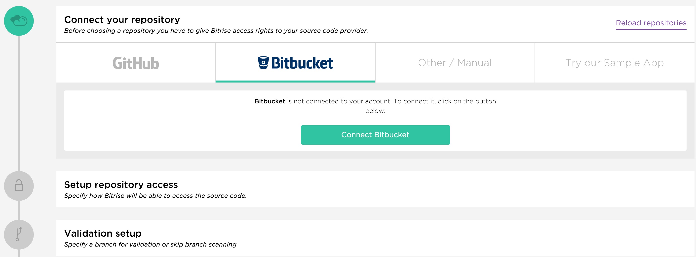
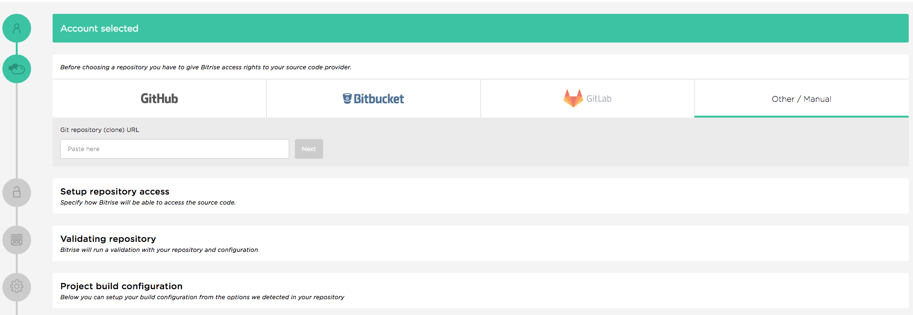

After you've selected adding a new app, you will find yourself on the `Create app` page.

Bitrise will give you options to connect any kind of git repository to it. `GitHub` and `Bitbucket` are supported out of the box.
If you've already authorized Bitrise, for example, with your GitHub,
you will see Bitrise automatically listing all your repositories, so you can just click on the one you'd like to connect.

!!! note "Connect any git repository to Bitrise"
    You can connect any private or public git repository to Bitrise.
    We will automatically create an SSH key that you can use to setup the connection with your provider.

If you haven't authorized Bitrise against the provider hosting your repository, it will ask for permission.

It will then list your repositories as above. If you'd like to connect git repository hosted by other than GitHub or Bitbucket,
select the `Other / Manual` tab.

You will have to add the git url of the repository you would like to connect.

!!! warning "Use SSH URLs for private repositories"
    Please note, that if you are connecting a private repository,
    Bitrise will try to clone it through SSH, so it's necessary to provide an SSH URL to your repository here.

Bitrise will add an SSH key to your repository at a later step.
Read more about how to add SSH keys automatically, or manually at [SSH keys](/adding-a-new-app/setting-up-ssh-keys/).
